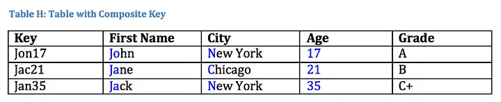
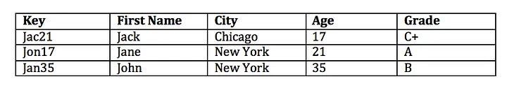

# Trust in AI

 

Many AI systems, particularly those built on deep learning neural networks, are fundamentally unexplainable and unpredictable. [4][16]

These systems learn to classify data by adjusting parameters within interconnected “neurons”, similar to the human brain. However, due to the vast number of parameters (often in the trillions), the reasons behind the decisions made by these AI systems are often cloudy.[4][16]

When humans can't comprehend something, they often trust it less.
 Therefore, trust is grounded in predictability, and if AI systems behave in ways that are not expected, their perceived trustworthiness diminishes.[1][5]

Having the capability to generate tremendous benefits for individuals and society, AI also gives rise to certain risks that should be properly managed.

Given that, overall, AI’s benefits outweigh. Its risks, we must ensure to follow the road that. Maximises the benefits of AI while minimising its risks. To ensure that we stay on the right track, a human-centric approach to AI is needed, forcing us to keep in mind that the development and use of AI should not be seen as a means in itself, but as having the goal to increase human well-being. [4][5][7]
 
Trustworthy AI will be our north star, since human beings will only be able to confidently and fully reap the benefits of AI if they can trust the technology.[2] Trustworthy AI has two components:

(1) it should respect fundamental rights, applicable regulation and core principles and values, ensuring an “ethical purpose” and (2) it should be technically robust and reliable since, even with good intentions, a lack of technological mastery can cause unintentional harm.
[2]

## Ensuring AI’s ethical purpose

Ensuring AI’s ethical purpose, by setting out the fundamental rights, principles and values that it should comply with guidance on the realisation of Trustworthy AI, tackling both ethical purpose and technical robustness. [2][3]

This is done by listing the requirements for Trustworthy AI and offering an overview of technical and non-technical methods that can be used for its implementation.[2] 
Operationalizes the requirements by providing a concrete but non-exhaustive assessment list for Trustworthy AI. This list is then adapted to specific use cases.[2]

 
## The 7 Key requirments
The guidelines put forward a set of 7 key requirements that AI systems should meet in order to be deemed trustworthy:

- __Human agency and oversight__: AI systems should empower human beings, allowing them to make informed decisions and fostering their fundamental rights.

- __Technical Robustness and safety__: AI systems need to be resilient and secure.

- __Privacy and data governance__: Full respect for privacy and data protection, adequate data governance mechanisms must also be ensured.

- __Transparency__: The data, system and AI business models should be transparent.

- __Diversity, non-discrimination and fairness__: Unfair bias must be avoided.

- __Societal and environmental well-being__: AI systems should benefit all human beings, including future generations.

- __Accountability__: Mechanisms must be in place to ensure responsibility and accountability for AI systems and their outcomes.
[10][2][3][7]
 

## Lack of transparency

The lack of transparency in AI systems is a significant barrier to their trustworthiness. A suggestion is that to build trust in AI, we need to understand how it makes decisions. This involves not only understanding the algorithms and data used to train the AI, but also the values and biases that may be embedded in these algorithms. [2][3][12]

 

## Important notes

We need to ensure that AI does not discriminate against certain groups or individuals and that it respects privacy and confidentiality.

 

### Government

There are some AIs that are banned in the European atmosphere. Due to the nature of the "Fediverse" we should know what is banned in what parts of the world and ensure that they are not available globally or continent wide.

The American government also has rules (bill) that the AI needs to follow. Here below you will get the complete list of possible systems/AI that are banned for the Americans and the Europeans. 

- Biometrics categorisation systems that use sensitive characteristics (e.g. political, religious, philosophical beliefs, sexual orientation, race);

- Untargeted scraping of facial images from the internet or CCTV footage to create facial recognition databases;

- Emotion recognition in the workplace and educational institutions;

- Social scoring based on social behaviour or personal characteristics;

- AI systems that manipulate human behaviour to circumvent their free will;

- AI used to exploit the vulnerabilities of people (due to their age, disability, social or economic situation).

 [6][8][11]

There are some Law enforcement exemptions in these, but we wouldn't come in contact with it.

A noteworthy mention is that you can also use AI to make more trustworthy AI. But the "Humans in the loop" still need to be practised even with that.[9][11]

Even if we (as the group) don't make these AIs, we need to think about how we can minimise the risk to the application. Because people will always have intentions, but they are sometimes things that we do not want.

 
## How to make the Data more secure

### Anonymization
Using data without taking care to protect the identity of the data owner can lead to lots of problems and potential lawsuits. Data anonymization easily put, is ensuring that we can’t tell the actual data owner by looking at the data.[15]
 
### Key Ways to Anonymize a Data Set
#### Replacing the key
In some cases removing the key and replacing it with a random number is sufficient. However, care must be taken to accommodate the composition of the data.[15]

Taking into account the composition of the table, we may find that the ids are repeating but the repeats are valid data points that we want to keep. In this case, we want to replace the same key with the same random number each time.[15]

#### Hashing & Random Mixing
When replacing the key with random keys is insufficient we can take other approaches.[15]

With Hashing converts the data into an alphanumeric or numeric code of fixed size, which cannot be easily reversed (if at all).[15]

Two key features of the hash:[15]
- It is technically feasible but practically impossible to reverse even the simplest hash i.e. you can go from A to hash(A) but not hash(A) to A.
- Hashing same value should provide same output each time and no two inputs should get same hash output (collision).

With random mixing is used when you might need data that has same structure and characteristics as the actual data set. In this you mix the table so the key is more random and the rows are not as it was before. An example below:[14][15]

 Before the shuffle.

 After the shuffle.

If you also add some Fake data to it / delete some data it will also be more anonymized.

## Approuches

###	Data Anonymization 
[14][15]

|#|Approach	|Description|Advantages|Disadvantages|Use Cases|
|--|--------|-----------|----------|-------------|---------|
|1	|Data Masking|	Masks or disguises sensitive data by replacing characters with symbols or placeholders.|- Simplicity of implementation.  - Preservation of data structure. |- Limited protection against inference attacks. - Potential negative impact on data analysis.|	- Anonymizing email addresses in communication logs.- Concealing rare names in datasets.- Masking sensitive words in text documents.|
|2|	Pseudonymization|	Replaces sensitive data with pseudonyms or aliases or removes it alltogether.|	- Preservation of data structure. - Data utility is generally preserved.  - Fine-grained control over pseudonymization rules. |	- Pseudomized data is not anonymous data.  - Risk of re-identification is very high.  - Requires secure management of pseudonym mappings. |	- Protecting patient identities in medical research.  - Securing employee IDs in HR records. |
|3	|Generalization/Aggregation|	Aggregates or generalizes data to reduce granularity.|	- Simple implementation.|	- Loss of fine-grained detail in the data.  - Risk of data distortion that affects analysis outcomes.  - Challenging to determine appropriate levels of generalization.|	- Anonymizing age groups in demographic data.  - Concealing income brackets in economic research. |
|4	|Data Swapping/Perturbation |	Swaps or perturbs data values between records to break the link between individuals and their data.|	- Flexibility in choosing perturbation methods.   - Potential for fine-grained control. |	- Privacy-utility trade-off is challenging to balance.   - Risk of introducing bias in analyses.   - Selection of appropriate perturbation methods is crucial.|	- E-commerce.  - Online user behavior analysis. |
|5	|Randomization|	Introduces randomness (noise) into the data to protect data subjects.|	- Flexibility in applying to various data types.  - Reproducibility of results when using defined algorithms and seeds.|	- Privacy-utility trade-off is challenging to balance.  - Risk of introducing bias in analyses. - Selection of appropriate randomization methods is hard.|	- Anonymizing survey responses in social science research. - Online user behavior analysis.|
|6	|Data Redaction|	Removes or obscures specific parts of the dataset containing sensitive information.|	- Simplicity of implementation.|	- Loss of data utility, potentially significant.  - Risk of removing contextual information.  - Data integrity challenges. |- Concealing personal information in legal documents.  - Removing private data in text documents.|
|7	|Homomorphic Encryption|	Encrypts data in such a way that computations can be performed on the encrypted data without decrypting it, preserving privacy.|	- Strong privacy protection for computations on encrypted data.  - Supports secure data processing in untrusted environments.  - Cryptographically provable privacy guarantees.|  - Encrypted data cannot be easily worked with if previously unknown to the user.   - Complexity of encryption and decryption operations.   - Performance overhead for cryptographic operations.  - May require specialized libraries and expertise.|	- Basic data analytics in cloud computing environments.  - Privacy-preserving machine learning on sensitive data.|
|8	|Federated Learning|	Trains machine learning models across decentralized edge devices or servers holding local data samples, avoiding centralized data sharing.|	- Preserves data locality and privacy, reducing data transfer.  - Supports collaborative model training on distributed data.   - Suitable for privacy-sensitive applications.	|- Complexity of coordination among edge devices or servers.   - Potential communication overhead.   - Ensuring model convergence can be challenging.   - Shared models can still leak privacy.	| - Healthcare institutions collaboratively training disease prediction models.  - Federated learning for mobile applications preserving user data privacy.   - Privacy-preserving AI in smart cities.|
|9	|Synthetic Data Generation	|Creates artificial data that mimics the statistical properties of the original data while protecting privacy.|	- Strong privacy protection with high data utility.   - Preserves data structure and relationships.   - Scalable for generating large datasets.|	- Accuracy and representativeness of synthetic data may vary depending on the generator.   - May require specialized algorithms and expertise. |	- Sharing synthetic healthcare data for research purposes.   - Synthetic data for machine learning model training.  - Privacy-preserving data sharing in financial analysis.|
|10	|Secure Multiparty Computation (SMPC)|	Enables multiple parties to jointly compute functions on their private inputs without revealing those inputs to each other, preserving privacy.|	- Strong privacy protection for collaborative computations.  - Suitable for multi-party data analysis while maintaining privacy.   - Offers security against collusion.	- Complexity of protocol design and setup.| - Performance overhead, especially for large-scale computations.  - Requires trust in the security of the computation protocol. |	- Privacy-preserving data aggregation across organizations.   - Collaborative analytics involving sensitive data from multiple sources.   - Secure voting systems.|

# Refrences
[1] https://www.theguardian.com/commentisfree/2021/oct/02/the-truth-about-artificial-intelligence-it-isnt-that-honest

[2] https://www.academia.edu/38205904/ETHICS_GUIDELINES_FOR_TRUSTWORTHY_AI

[3] https://www.academia.edu/67787782/Trustworthy_AI_From_Principles_to_Practices

[4] https://theconversation.com/why-humans-cant-trust-ai-you-dont-know-how-it-works-what-its-going-to-do-or-whether-itll-serve-your-interests-213115

[5] https://www.nist.gov/publications/trust-and-artificial-intelligence

[6] https://www.europarl.europa.eu/news/en/press-room/20231206IPR15699/artificial-intelligence-act-deal-on-comprehensive-rules-for-trustworthy-ai

[7] https://ieeexplore.ieee.org/abstract/document/10188681

[8] https://www.whitehouse.gov/ostp/ai-bill-of-rights/

[9] https://scienceexchange.caltech.edu/topics/artificial-intelligence-research/trustworthy-ai

[10] https://www.hindawi.com/journals/ijis/2023/4459198/

[11] https://onlinelibrary.wiley.com/doi/full/10.1111/rego.12512

[12] https://ieeexplore.ieee.org/abstract/document/10086944

[13] https://www.tandfonline.com/doi/full/10.1080/07421222.2023.2196773?needAccess=true (not used because it's paid)

[14] https://mostly.ai/blog/data-anonymization-tools

[15] https://towardsdatascience.com/anonymizing-data-sets-c4602e581a35

[16] https://openaccess.thecvf.com/content/WACV2023/papers/Ciftci_My_Face_My_Choice_Privacy_Enhancing_Deepfakes_for_Social_Media_WACV_2023_paper.pdf
